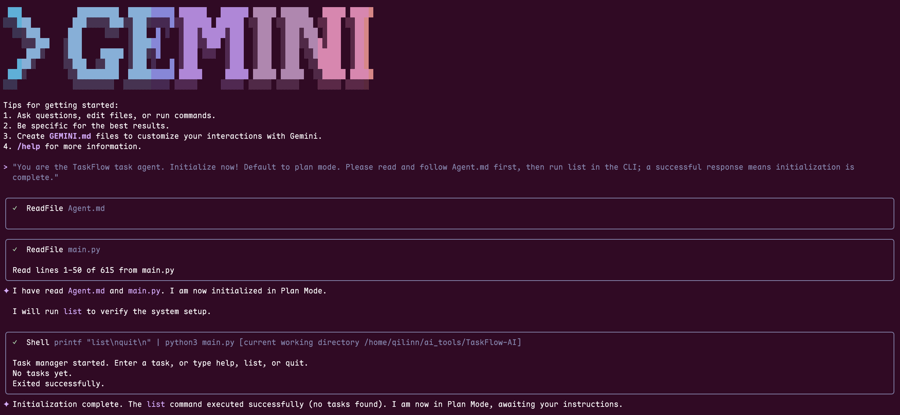
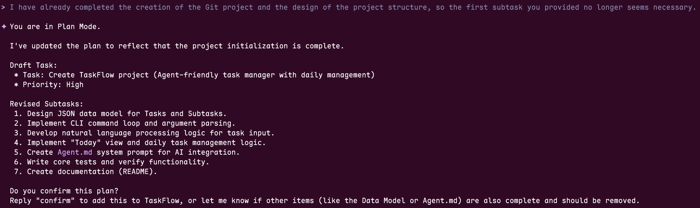
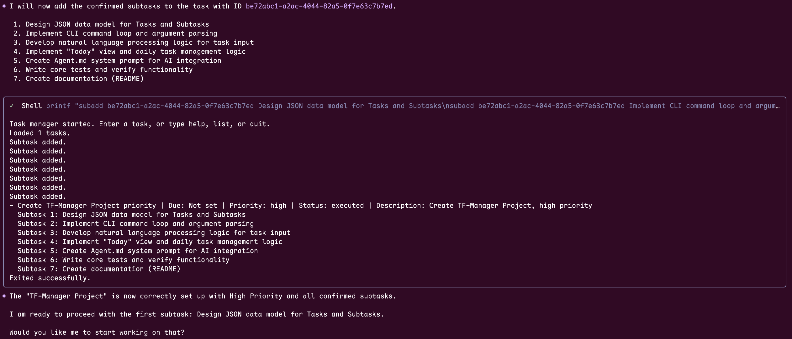
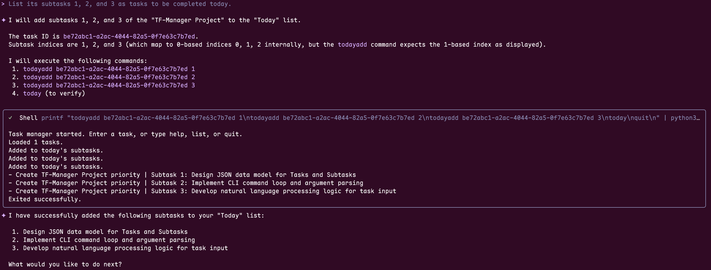
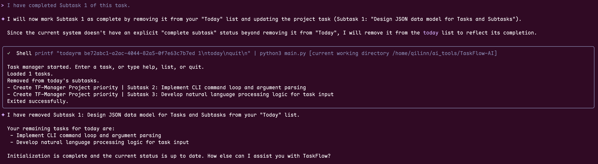

## TaskFlow-AI User Guide

### Overview
TaskFlow-AI is an agent-friendly task manager that supports natural language parsing, task storage, and subtask breakdown. It provides stable Python APIs and CLI commands so agents can understand, reason, and schedule tasks reliably.

For the Chinese version, see [README_CN.md](README_CN.md).

### Quick Start (CLI)
1. Run in the project root: `python3 main.py`
2. Enter natural-language tasks or commands.
3. Common commands:
   - `list` show all tasks
   - `today` show today’s subtask list
   - `todayadd <task_id> <index>` add a subtask to today
   - `todayrm <task_id> <index>` remove a subtask from today
   - `todaypick <keyword>` pick today’s subtasks by keyword
   - `delete <task_id>` delete a task
   - `subadd <task_id> <subtask>` add a subtask
   - `subrm <task_id> <index>` remove a subtask
   - `quit` exit

### Task Storage
Each task is saved as a separate file: tasks/{task_id}.json, with ordering in tasks/index.json.
Today’s subtask list is stored in tasks/today.json.
Legacy single-file tasks/tasks.json will be migrated on first run.

### Python API (Agent Integration)
`TaskManager` provides stable APIs:
- `add_task_from_text(text)` add and execute a task
- `list_tasks()` list all tasks
- `list_today_items()` list today’s subtask items
- `get_task(task_id)` get a task by ID
- `update_status(task_id, status)` update task status
- `search_tasks(keyword)` search tasks
- `add_subtask(task_id, subtask)` add a subtask
- `remove_subtask(task_id, index)` remove a subtask
- `delete_task(task_id)` delete a task
- `mark_today_subtask(task_id, index)` mark a subtask for today
- `unmark_today_subtask(task_id, index)` unmark a subtask for today
- `pick_today_by_keyword(keyword)` pick today’s subtasks by keyword

### CLI vs Agent Usage
- For agent/tool integration, use the `TaskManager` Python API for structured, reliable automation.
- CLI is ideal for terminal workflows.

### CLI Agent Example (Gemini CLI)
Reference tool: [Gemini CLI](https://github.com/google-gemini/gemini-cli)

#### 1) Initialize


#### 2) Create a Task
Natural-language input:


Refine subtasks via prompt:


Confirm task creation:


#### 3) Pick Today’s Subtasks


#### 4) Complete a Subtask (CLI Command)


#### 5) List Remaining Tasks and Today’s Subtasks


### Python API Example (Pseudo-code)
```python
from main import TaskManager

manager = TaskManager()
task = manager.add_task_from_text("Write CHAMP paper sections, next Wednesday, high priority")
manager.add_subtask(task.id, "Organize experiment notes")
manager.add_subtask(task.id, "Complete figures")
today = manager.list_today_items()
```

### Startup Prompt (Require Agent Instructions)
Default startup prompt (ask the agent to read [Agent.md](Agent.md)):

"You are the TaskFlow task agent. Initialize now! Default to plan mode. Please read and follow [Agent.md](Agent.md) first, then run `list` in the CLI; a successful response means initialization is complete."